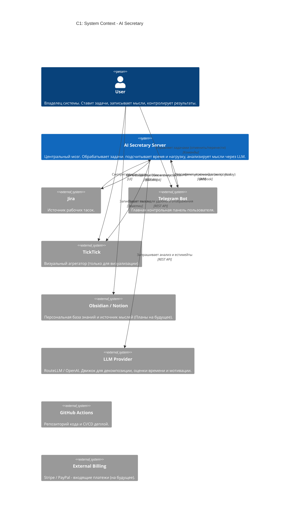
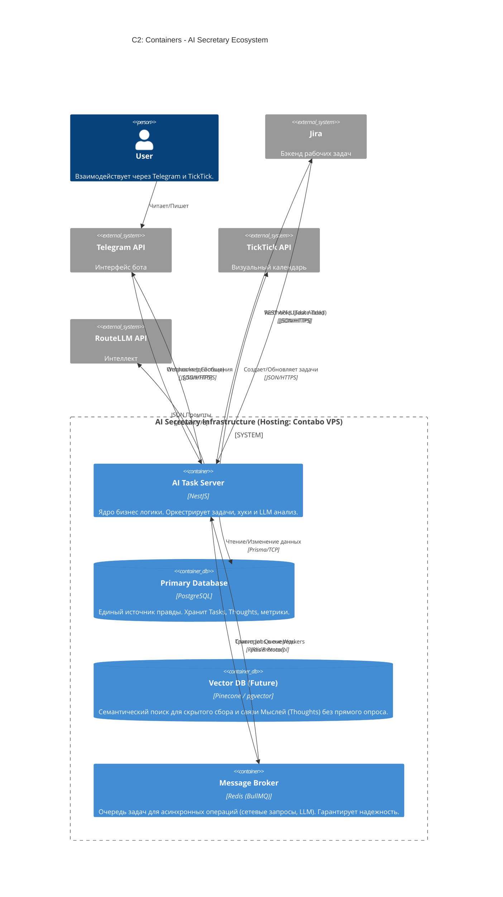
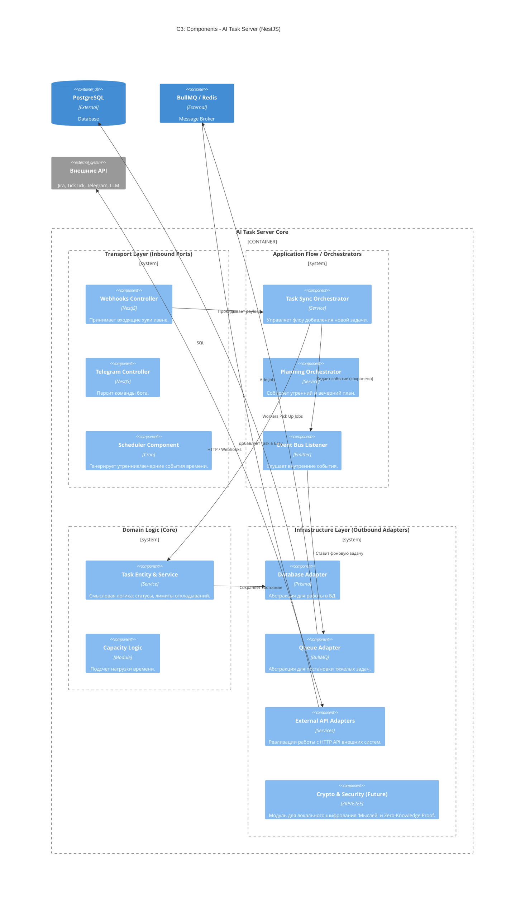

# AI Secretary - С4 Архитектура

Этот документ описывает статичную архитектуру системы AI Secretary на уровнях C1 (Системный контекст), C2 (Контейнеры) и C3 (Компоненты ядра), следуя философии `Tasks -> Result -> Thoughts -> Tasks`.

## C1: Системный контекст (System Context)
Центром экосистемы является ядро AI Secretary, которое связывает разрозненные инструменты вместе, опираясь на [Фундаментальную философию проекта](file:///c:/Projects/AI%20Secretary/AI-Secretary/docs/mind_cycle_philosophy.md).

## C2: Контейнеры (Containers)
Уровень контейнеров показывает из каких крупных технических компонентов состоит система, где находится база данных и очереди.

## C3: Компоненты (Components - AI Task Server)
Внутренняя структура NestJS приложения, следующая подходу Гексагональной архитектуры (Разделение на транпорт, ядро и адаптеры).

