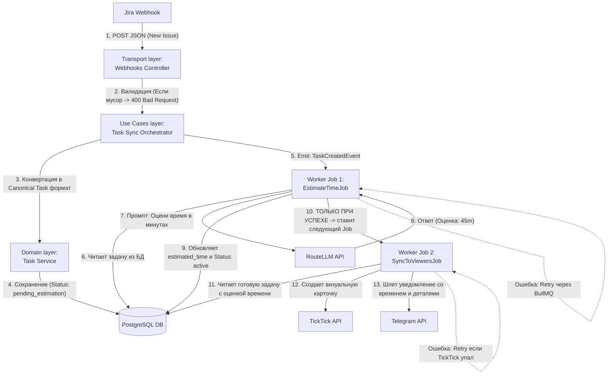
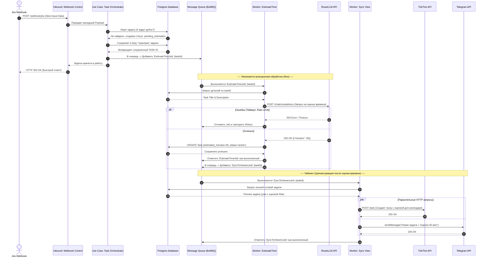

# AI Secretary - Data Flow и Sequence Диаграммы

Этот документ описывает динамику прохождения данных сквозь систему. В качестве примера используется самый частый сценарий: **Создание новой задачи во внешнем источнике (Jira) и её обработка сервером**.

Данные диаграммы учитывают последовательное (Chained) выполнение фоновых задач во избежание "гонки данных" (Race Conditions).

## Data Flow Diagram (DFD)

Диаграмма потока данных показывает шаги, через которые протекает информация, и как обрабатываются ошибки (чтобы пользователь не увидел пустую задачу без оценки времени).

## Sequence Diagram

Диаграмма последовательности (Sequence) делает акцент на *временных интервалах* и ответах систем. Она показывает, что мы быстро возвращаем 200 OK для Jira, а вся тяжелая работа выносится в асинхронную очередь.

